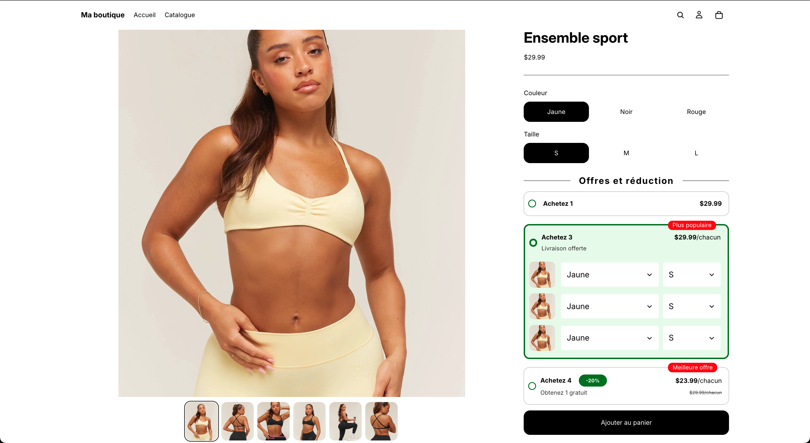
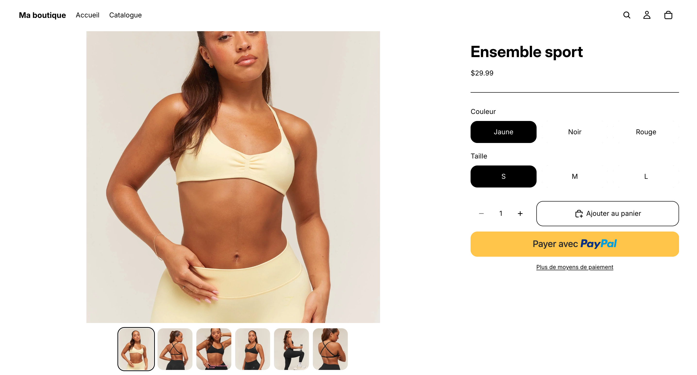

<a href="README.md">Read in English</a>

# Shopify Bundle Selector — Sélecteur de paliers "Achetez plus, économisez plus"

Un sélecteur de paliers d'achat intégré au thème, pour les fiches produit
Shopify : le client choisit "Achetez 1 / 3 / 5" (ou tout autre palier
configuré), chacun avec sa propre réduction, et ajoute tout le pack au panier
en un seul clic — avec un sélecteur de variante (couleur, taille…) distinct
pour chaque unité du pack.

Conçu pour le thème **Shopify Horizon**. Aucune application tierce, aucun
abonnement mensuel, aucun poids ajouté à la page au-delà d'un petit web
component.

| Bundle Selector activé | Boutons d'achat natifs |
|---|---|
|  |  |

## Fonctionnalités

- Nombre de paliers configurable, chacun avec un libellé, un sous-titre
  optionnel, et sa propre réduction : pourcentage, montant fixe, ou N unités
  offertes
- Badge de coin optionnel par palier (ex. "Plus populaire", "Meilleure
  offre")
- Économie affichée en `-15%` ou `-29,99$` — le marchand choisit le format
- Si le produit a des variantes, chaque unité d'un palier à plusieurs unités
  a son propre menu déroulant — on peut commander un pack de 3 en trois
  couleurs différentes en une seule commande
- Un clic ajoute chaque unité comme sa propre ligne de panier, taguée avec
  une propriété `_bundle_id` partagée, pour pouvoir les regrouper/suivre en
  aval
- Chaque palier porte un **code de palier** saisi par le marchand, écrit dans
  la commande en `_bundle_tier_code` — une clé stable qui survit au
  renommage du palier et reste identique dans toutes les langues, pour que
  les fonctions de remise et les rapports aient enfin quelque chose de
  fiable à comparer. L'éditeur de thème signale les codes vides ou en
  doublon avant qu'ils n'atteignent une commande
- Entièrement configurable depuis l'éditeur de thème : couleurs,
  typographie, espacement — aucune modification de code nécessaire pour le
  personnaliser
- Peut être fusionné dans le bloc natif "Boutons d'achat" du thème derrière
  une simple case à cocher, pour que le marchand puisse l'activer ou le
  désactiver par produit sans manipuler de blocs (voir
  `docs/integration-guide.md`)

## Contenu du dépôt

Ce dépôt contient **uniquement le code personnalisé de cette fonctionnalité**
— pas le thème Horizon complet, qui appartient à Shopify. Ces fichiers sont
à copier dans un thème Horizon existant (ou dérivé de Horizon).

| Chemin | Rôle |
|---|---|
| `blocks/bundle-tier.liquid` | Bloc enfant — un par palier. Calcule le prix, affiche la ligne, gère les sélecteurs de variante par unité |
| `blocks/bundle-selector.liquid` | Bloc parent autonome — à utiliser si tu veux le sélecteur comme bloc indépendant |
| `snippets/bundle-selector-styles.liquid` | Tout le CSS |
| `assets/bundle-selector.js` | Le web component `<bundle-selector-component>` — bascule entre paliers, résolution des variantes, ajout au panier |
| `assets/bundle-tier-code-warnings.js` | Composant réservé à l'éditeur, qui signale les codes de palier vides ou en doublon. Jamais chargé côté client |
| `snippets/bundle-tier-code-warnings.liquid` | Affiche le composant ci-dessus et lui transmet les messages traduits |
| `locales/*.json`, `locales/*.schema.json` | Traductions anglais + français (texte client et éditeur) |
| `docs/integration-guide.md` | Comment l'installer en autonome, ou le fusionner dans le bloc natif de boutons d'achat de ton thème |
| `docs/gotchas.md` | Pièges techniques rencontrés en le construisant, pour ne pas les retrouver toi-même |

## Démarrage rapide

1. Copie `blocks/`, `snippets/`, `assets/` et les clés de `locales/` dans
   ton thème.
2. Dans l'éditeur de thème, ajoute le bloc **Bundle selector** à un modèle
   de produit, puis ajoute un ou plusieurs blocs **Bundle tier** en dessous.
3. Configure le libellé, le nombre d'unités et la réduction de chaque
   palier.

Pour la version fusionnée dans le bloc natif de boutons d'achat
(recommandée en production — permet au marchand de l'activer par produit
avec une seule case à cocher), voir `docs/integration-guide.md`.

## Limitation connue : prix affiché vs. prix au panier

Le prix affiché dans le sélecteur est **destiné à l'affichage uniquement**
— il n'est pas automatiquement appliqué au moment du paiement. Pour que le
prix facturé corresponde à ce qui est affiché, il faut choisir :

1. **Une réduction Shopify native correspondante**, configurée manuellement
   dans Admin → Réductions (le plus simple, zéro code — demande de garder
   les deux synchronisés à la main)
2. **Une Shopify Function** qui lit les propriétés de ligne déjà posées par
   ce sélecteur et applique la réduction automatiquement (solution propre et
   fiable, mais un développement d'extension d'app complet — pas du code de
   thème). Comparer sur `_bundle_tier_code`, pas sur `_bundle_tier` : le
   libellé est un texte d'affichage qu'un marchand peut renommer et qu'une
   traduction peut changer, le code non. Regrouper les lignes d'un même
   bundle par `_bundle_id`.

   Deux règles pour cette Function. Les propriétés de ligne sont modifiables
   par le client via l'API panier : **n'y lisez jamais un montant de
   remise** — lisez l'identité du palier, puis allez chercher la remise dans
   une source que vous maîtrisez et revérifiez que les quantités de la ligne
   correspondent au palier revendiqué. Et les commandes passées avant
   l'ajout des codes n'en auront pas : retomber sur `_bundle_tier` quand
   `_bundle_tier_code` est absent.
3. **Des variantes/produits de bundle dédiés** à prix fixe, pour que le
   sélecteur ajoute une vraie variante "Pack de 3" plutôt que 3× la variante
   normale

À trancher avec le propriétaire de la boutique *avant* de le mettre en place
— ça détermine l'ampleur du travail côté backend.

## Licence

MIT — voir `LICENSE`.
